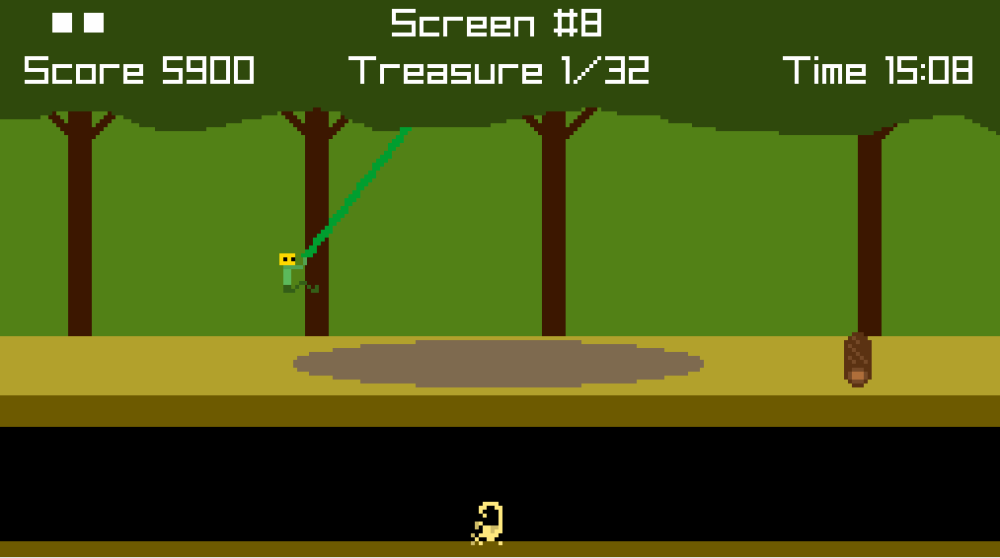

# Pitfall Remake

This is a remake of the original Atari 2600 version of Pitfall. It uses [raylib](https://www.raylib.com/), is written in [Odin](https://odin-lang.org/), and used [this nice starting template](https://github.com/karl-zylinski/odin-raylib-hot-reload-game-template) as a base.

  
  

    <a href="https://auwsmit.github.io/pitfall-remake/"><b>Click here to play in browser!</b></a>
  

Runs on Windows, Linux, MacOS, and browsers.

## Controls

Also includes standard controller support.

- **Move:** `WASD` or arrow keys
- **Jump:** `W`/`Up`/`Spacebar`
- **Dismount ladder:** `A`/`D`/`Left`/`Right`
- **Dismount vine:** `S`/`Down`
- **Pause:** `Esc`/`P`
- **Fullscreen:** `Alt+Enter`/`F11`

## How to Build
- Run the build script for your desired platform. The output executable will be in `build/`.

## Requirements to build:

- [Odin compiler](https://github.com/odin-lang/Odin/releases)
- [Emscripten](https://emscripten.org/docs/getting_started/downloads.html) (only for web)
